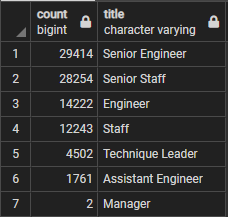
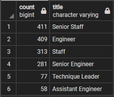

# pewlett-hackard-analysis

## Overview
The objective of this analysis was to determine how many employees of the Pewlett-Hackard company are eligible for retiring.
In addition, the analysis should indicate if there are a sufficient number of veteran employees to train up incoming replacements should retirements start increasing.
## Results
### Employees Eligible for Retirement:

- It can be seen from the table above that there will be 90,398 employees that will be eligible for retirement.
- If we consider Senior Engineer, Senior Staff, Technique Leader, and Managers as senior positions then about 68.78% of the employees eligible for retirement are in senior positions.

### Employees Eligible for Mentorship Program:

- From the table above it can be seen that 1,549 employees are eligible to be in the proposed mentorship program.
- If Senior Staff, Engineer, Senior Engineer, and Technique Leaders are considered to be qualified to train for the mentorship program then this corresponds to about 76% of the employees in the 1,549 mentioned previously.

## Summary
- How many roles will need to be filled as the "silver tsunami" begins to make an impact?
  - There will be 90,398 employees eligible for retirement in the "silver tsunami." 
  This total can be calculated from the following query:
  ```
   select 
        sum(count)
   from 
        retiring_titles;
  ```
- Are there enough qualified, retirement-ready employees in the departments to mentor the next generation of Pewlett-Hackard employees?
  - There are an insufficient number of employees to train those that would be lost from the "silver tsunami."
  In the best case scenario there are 1,549 employees eligible to be mentors, which would equate to a 58:1 mentee to mentor ratio.
  The query to generate the second table above is provided below:
  ```
  select 
        count(emp_no), title
  from 
        mentorship_eligibility
  group by 
        title
  order by 
        count desc;
  ```
  